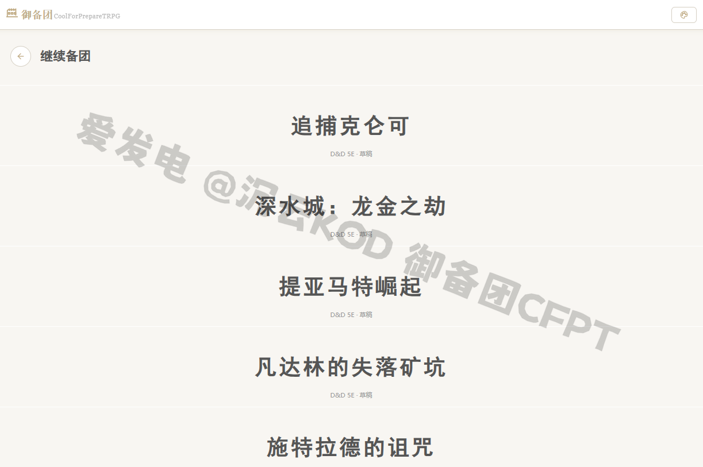
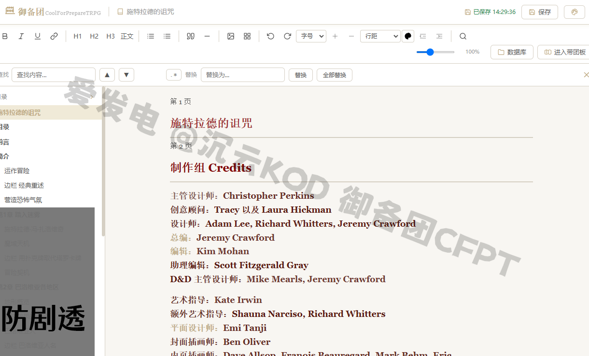
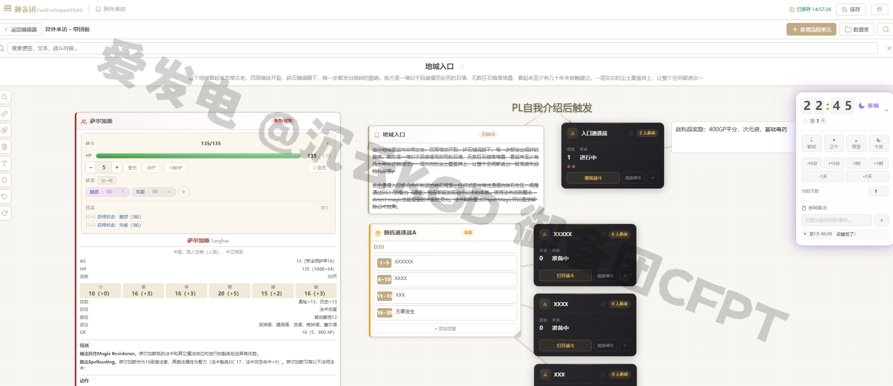
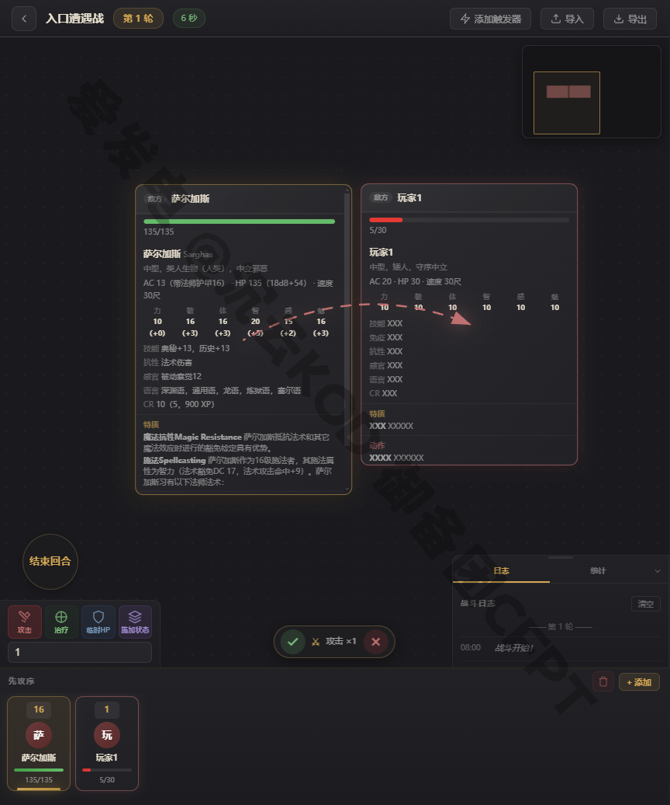

# 备团助手 / 御备团 (CoolForPrepareTRPG)

一款基于 Electron 的 TRPG（DND 5e/5r）主持人（GM）备团与带团效率工具，帮助你在一处完成模组管理、文档编写、带团板调度与战斗流程管理。

## 功能特性

- **模组列表管理**：集中管理你的跑团模组与存档，实时自动保存
- **文档编辑器**：内置富文本编辑，支持导入 Word/PDF 等资料并转为备团文档
- **带团板**：分屏展示剧情流程单元，按需呈现给玩家的信息
- **战斗模块**：管理先攻、回合与战斗状态
- **DND 数据查询**：内置法术、物品与规则数据库

## 截图

| 模组列表 | 文档编辑器 | 带团板 | 战斗模块 |
|---|---|---|---|
|  |  |  |  |

## 技术栈

- Electron 33+
- 原生 HTML / CSS / JavaScript
- [mammoth](https://www.npmjs.com/package/mammoth)（Word 导入）、[PDF.js](https://mozilla.github.io/pdf.js/)（PDF 预览）、[xlsx](https://www.npmjs.com/package/xlsx)（表格处理）

## 快速开始

```bash
cd electron-app
npm install
npm start
```

### 打包 Windows 安装包

```bash
cd electron-app
npm run build
```

输出位于 `electron-app/dist/`。

## 目录结构

- `electron-app/` — 主应用程序源码（主进程、渲染进程与页面）
- `libs/` — 前端第三方库
- `截图/` — 界面截图与设计素材

## 许可证

本项目采用 [GPL-3.0](LICENSE) 许可证开源，商业使用请参阅 [LICENSE_COMMERCIAL.md](LICENSE_COMMERCIAL.md)。

> 注意：仓库不包含第三方 DND 规则书文本内容（`规则书/`），相关法律法规与版权内容请自行获取。
